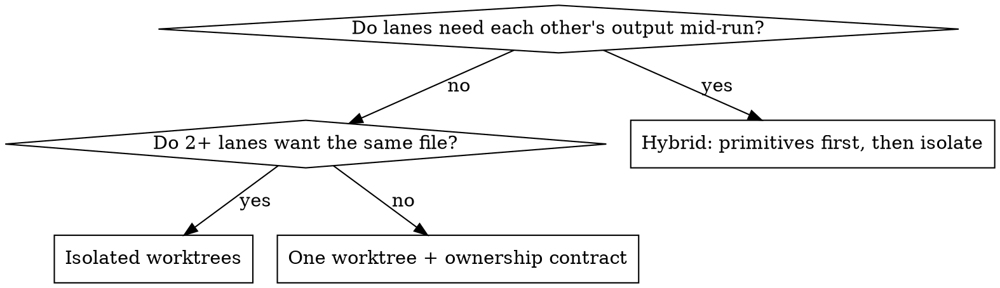

# Dispatching Kimi Fleets

Kimi K3 runs through **`omp`** (Oh My Pi), a local agent CLI. There is no `kimi`
binary, no `omp agent run` subcommand, and no `MOONSHOT_API_KEY` in this setup.

**Model routing on this project:** Sonnet is the default for every agent lane;
there are no Opus lanes. Haiku is fine for cheap, wide sweeps but its output
must be fact-checked before it's trusted or published — it invents plausible
detail under-specified in its prompt. `omp`/Kimi K3 fits the same niche as
Haiku here: fast, cheap, wide, and needs a human or a second pass to confirm
anything load-bearing. Hard SQL/migration reviews go through `codex:codex-rescue`
(told to run the Codex CLI itself), not Kimi.

## The invocation

```bash
omp --model kimi-k3 -p "your prompt"
```

That is the whole form. Baseline testing (4/4 fresh agents) invented
`kimi --yolo`, `omp agent run`, and an API key — **verify the binary before
building a fleet on it**: `omp models | grep kimi` should print `kimi-k3`.

| Need                             | Flag                                   |
| --------------------------------- | --------------------------------------- |
| Non-interactive, exit when done   | `-p` / `--print`                        |
| Deep analysis                     | `--thinking max` (also `low`, `high`)   |
| Read-only audit (no edits)        | `--no-tools`                            |
| Scope beyond cwd                  | `--add-dir <path>`                      |
| Run in another dir                | `--cwd <path>`                          |
| Don't persist a session           | `--no-session`                          |
| Wall-clock cap                    | `--max-time 15m`                        |
| Check quota first                 | `omp usage`                             |

## The constraint that decides your design

**Kimi K3 caps output at ~8.2K tokens.** A "audit the whole codebase and write a
full report" prompt returns a **truncated** answer, and truncation looks like a
finished answer.

So: **one narrow deliverable per invocation.** Ask for a findings TABLE with
`file:line`, severity, and a one-line fix — not prose, not a document. If you
want a full audit of, say, all 35+ migrations or the whole `apps/web/src/features`
tree, that is 3–5 scoped invocations (e.g. one per migration range, one per
feature module) you concatenate yourself, never one big ask.

Check before you trust: if the reply ends mid-sentence or mid-row, it truncated.

## Choosing a topology



**Read-only audit fleets need no worktrees at all.** Nothing is written, so
there is nothing to isolate — run them concurrently in one checkout with
`--no-tools` and redirect each to its own report file. Worktrees are for agents
that WRITE.

In this repo, worktrees live under
`/Users/khumeren/Repos/personal-work/trainos-wt/<lane-name>` (primary checkout
at `/Users/khumeren/Repos/personal-work/trainos`), branched from
`origin/main` on `github.com/PARALLELPARADIGMS/TrainOS`. See also
[[agent-task-contract]] §5 for the topology decision table and the
`ActionOutcome`-duplication incident that motivates it.

If a lane touches `supabase/migrations/`, remember: RPC-only backend (never
Edge Functions), one migration file at a time (`NNN_slug.sql`) with a matching
rollback in `supabase/rollbacks/` and a pin in `supabase/tests/`, and the
catalog (`supabase/migrations/migration-catalog.md`) updated in the SAME
commit. Hosted project ref is `balzmmsmrawzmefkavte` (TrainOS, ap-southeast-1)
— never assume a different project.

Full patterns, failure modes and the pre-dispatch checklist:
**fleet-patterns.md** in this directory. Read it before dispatching writers.

## Every dispatch carries these four

Baseline agents outside a repo with an `AGENTS.md`/`CLAUDE.md` produced **none**
of these. They are not optional and they are not discoverable — put them in
the prompt:

1. **Base SHA, stated and verified.** `git worktree add <wt> -b <branch> <SHA>`,
   and the brief tells the agent to confirm it. A stale base is how a lane
   lands behind a live fix on a money-sensitive path (invoicing, HRD Corp
   claims) without anyone noticing until merge.
2. **File ownership as an allow/deny list**, naming the OTHER lanes' paths
   explicitly. "Don't touch unrelated files" is not actionable.
3. **Verify your premises.** "The claims in this brief may be stale. Check them
   against source (and `ai/resume-brief.md` / `ai/project-log.md`); end with
   what you could NOT verify." Docs rot; a false premise costs 10–20 minutes
   before anyone notices.
4. **Findings get pinned, not silently fixed.** An audit reports; it does not
   refactor.

## Reading the result

- **Never trust an exit code.** `omp` exits 0 on a truncated or degraded reply.
  Read the output.
- **Never trust an agent's own gate output** in a shared tree — it sees other
  lanes' half-written files. Re-run `npm run typecheck` / `npm test -- --run`
  yourself on the settled tree, with `VITE_API_MODE=fixtures
  VITE_SHOW_ERROR_DETAILS=false` — a bare `vitest` at repo root also produces
  its own kind of false signal (phantom failures from skipped alias config),
  independent of shared-tree noise.
- **An empty diff is not "finished."** Wait for work to APPEAR, then to
  stabilise. Absence read as a value is this domain's recurring bug class.

## Common mistakes

| Mistake                             | Fix                                              |
| ------------------------------------- | --------------------------------------------------- |
| `kimi --model kimi-k3`                | No such binary. `omp --model kimi-k3`               |
| `omp agent run …`                     | No such subcommand. Plain `omp --model … -p …`      |
| One prompt for a full audit           | Truncates at ~8.2K out. Scope it, run 3–5           |
| Worktrees for a read-only sweep       | Unnecessary. Nothing is written                     |
| Bare `git commit` in a shared worktree | Never. Pathspec only: `git add -- <files> && git commit -m "…" -- <files>` |
| Trusting `omp models` from memory     | It changes. Run it                                  |

## Feeding lessons back

These patterns came from real runs and are meant to keep improving. When a
fleet run teaches something — a new failure mode, a flag that mattered, a
constraint discovered — append it to the vault notes and say so in your report:

```
/Users/khumeren/Obsidian/Radiant/Main/Software Engineering Patterns/DevOps & Automation/
  Single-Worktree Agent Fleet.md
  Parallel-Agent Worktree Isolation.md
```

Add to the existing sections rather than rewriting them, keep the `updated:`
frontmatter current, and record what was MEASURED versus what was inferred —
both notes are explicit that unverified claims are the thing that costs time.
