# Agentic TPMS

**Training Provider Management System / Agentic CRM** for an independent Malaysian corporate
training provider operating under the **HRD Corp SBL-Khas** direct-grant framework.

It runs the whole job: inbound lead → TNA → priced quotation → e-TRiS grant → trainer, venue
and cohort → day-of-event attendance → certificates → claim pack → HRD Corp remittance →
trainer and vendor payouts → retention cadences. Two deterministic state machines sit in
the middle, a five-tier agent pool around them, and a named human at every gate that
spends money or commits the provider.

> Single-tenant by design: one provider, one database, no tenant columns.
> The design language is forked from TrainOS (the parent repository, read-only); this folder
> is an independent application and edits nothing outside itself.

---

## Contents

1. [What it does](#what-it-does)
2. [Screenshots](#screenshots)
3. [Architecture](#architecture)
4. [Running it](#running-it)
5. [Bring your own key](#bring-your-own-key)
6. [Moving to Supabase](#moving-to-supabase)
7. [The state machines](#the-state-machines)
8. [The three HITL gates](#the-three-hitl-gates)
9. [Compliance: audit ledger, vault, PII](#compliance)
10. [The golden path](#the-golden-path)
11. [Testing](#testing)
12. [Repository map](#repository-map)
13. [Honest limitations](#honest-limitations)

---

## What it does

| Stage | What the system does | Who decides |
|---|---|---|
| 1 · Demand | Meta Lead Ads, Google Ads lead forms, LinkedIn, WhatsApp Cloud API and inbound e-mail (virtual forwarding mailbox + smart BCC) land on webhooks, are hashed, de-duplicated and classified by the L1 router (P(levy), intent, urgency, abstain). Qualified leads get the 60-second WhatsApp micro-TNA. | Operator triages the ambiguous band; approves every outbound e-mail batch. |
| 2 · TNA & quote | pgvector search over the course catalogue + JPK/NOSS + HRD focus areas, a Form HRD-L&D outline with Bloom's-taxonomy outcomes, and a quotation priced by the **headless Univer formula engine** against the Allowable Cost Matrix, cross-checked to the sen by an independent TypeScript model. | **Gate 1** — operator reviews the worksheet in an embedded Univer canvas and approves & dispatches. |
| 3 · Grant | e-TRiS support dossier (outline, quote, trainer CV, TTT certificate, manifest with SHA-256s), approval-letter extraction (L2), optional 30% upfront claim. | Operator verifies the extracted grant ID, pax and amount. |
| 4 · Operations | Trainer holds (tentative → confirmed, pay-when-paid), venue BEO / printing DO, and the **T-14 viability check** leased from the task queue. | **Gate 2** — below 5 pax, vendor auto-confirmations halt; operator chooses postpone / pivot to ROT / cancel / proceed. |
| 5 · Delivery | Dual-track attendance: zero-auth JWT magic links and session QR (Track A), Form T3 scans through the OpenCV/PaddleOCR microservice (Track B), photo EXIF checks, Kirkpatrick L2 pre/post quizzes, tamper-evident PDF certificates with public QR verification. | Operator resolves attendance exceptions on the exception desk. |
| 6 · Claims & AP | HRD Corp tax invoice, SBL-Khas claim pack (ZIP + manifest of hashes), claim FSM through query/approval/remittance, payment vouchers, bank reference + receipt, unit economics. | **Gate 3** — operator approves the claim pack, then confirms every disbursement. |
| 7 · Retention | T+14 executive delivery pack, T+90 curriculum laddering, T+300 levy-utilisation alert — drafted by L4, dispatched only on approval. | Operator approves each proposal. |

## Screenshots

Captured from the seeded demo (`npm run db:seed -- --reset`). `npm run screenshots` photographs
every screen (each nav route, and every record tab for one package per stage) into
`test-results/screenshots`. It fails if any screen errors, shows the Next error overlay, or lets
the page scroll sideways; the latest run covered 86 screens with 0 failures. Every company,
person and reference below is fictional.

| | |
|---|---|
| 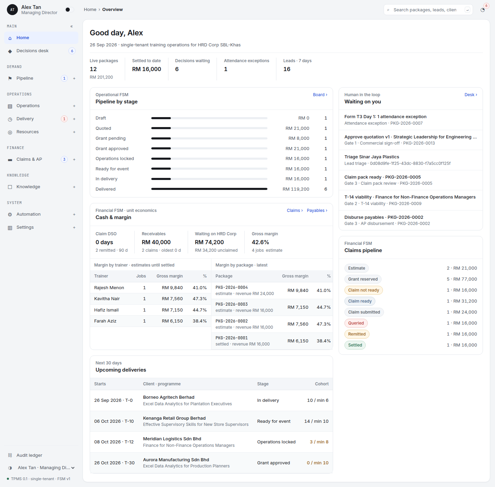 **Home**: pipeline by stage, cash and margin, what is waiting on you | 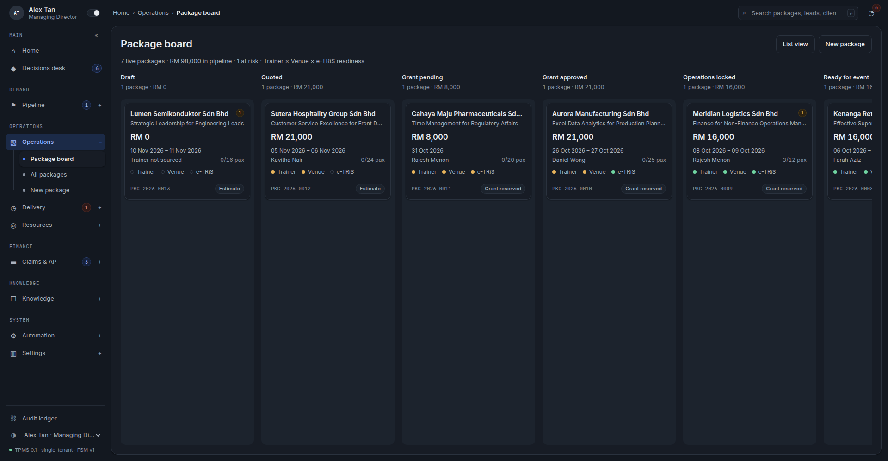 **Package board**: Trainer × Venue × e-TRiS readiness lights (dark theme) |
| 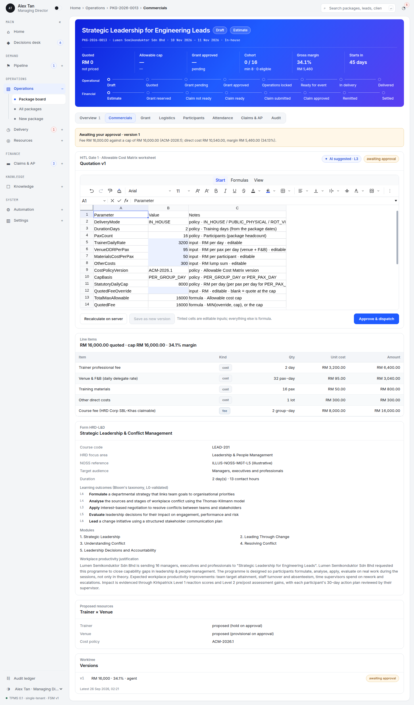 **Gate 1**: the AI quotation on the Univer Allowable Cost Matrix worksheet, awaiting approval | 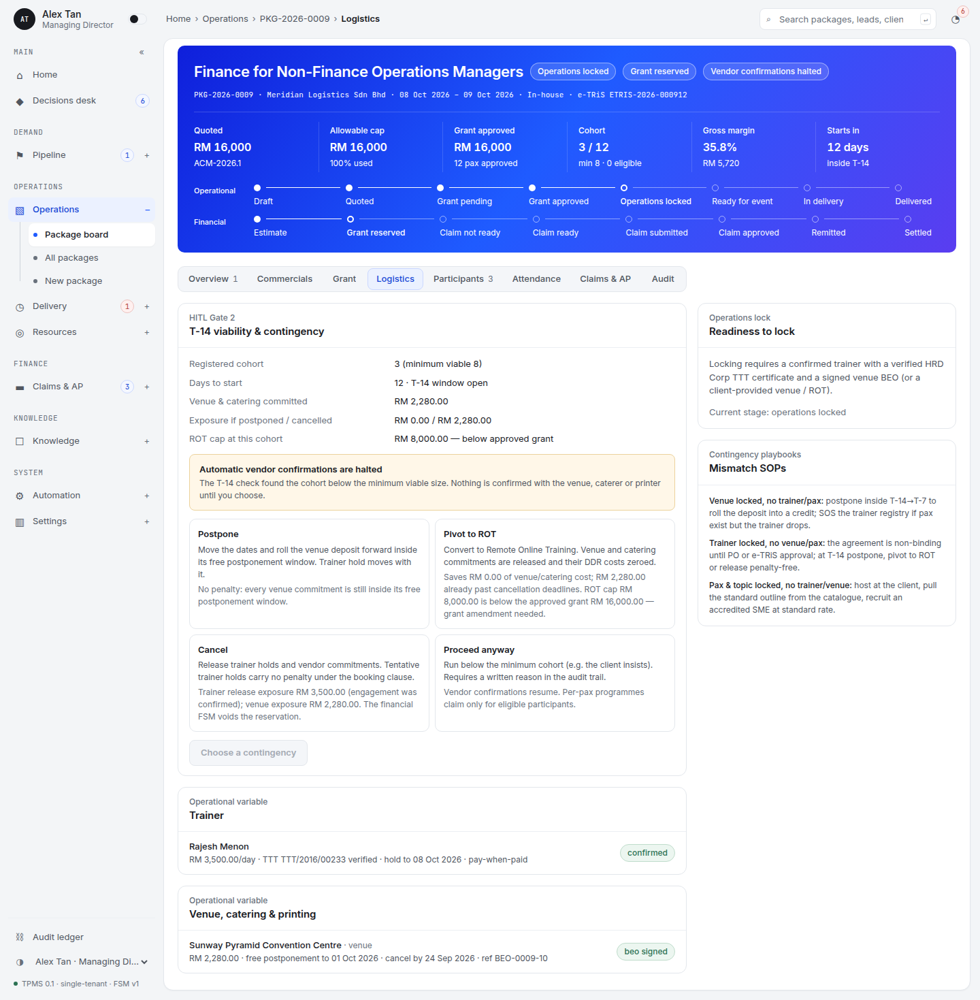 **Gate 2**: T-14 viability below the minimum cohort, with postpone / pivot to ROT / cancel / proceed |
| 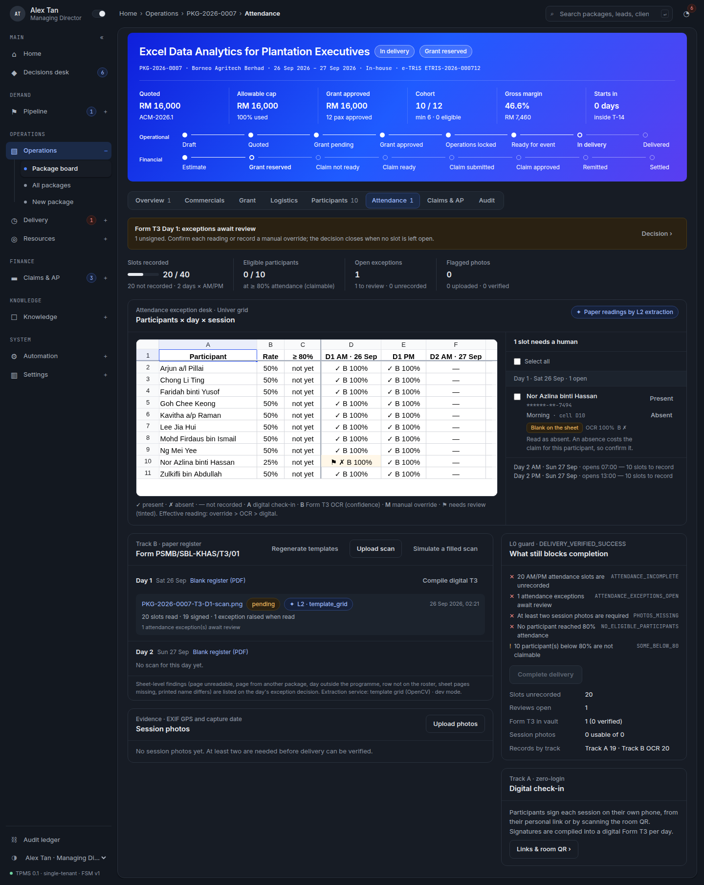 **Attendance exception desk**: Univer grid with the Track A / Track B readings, the OCR exception and the completion guard | 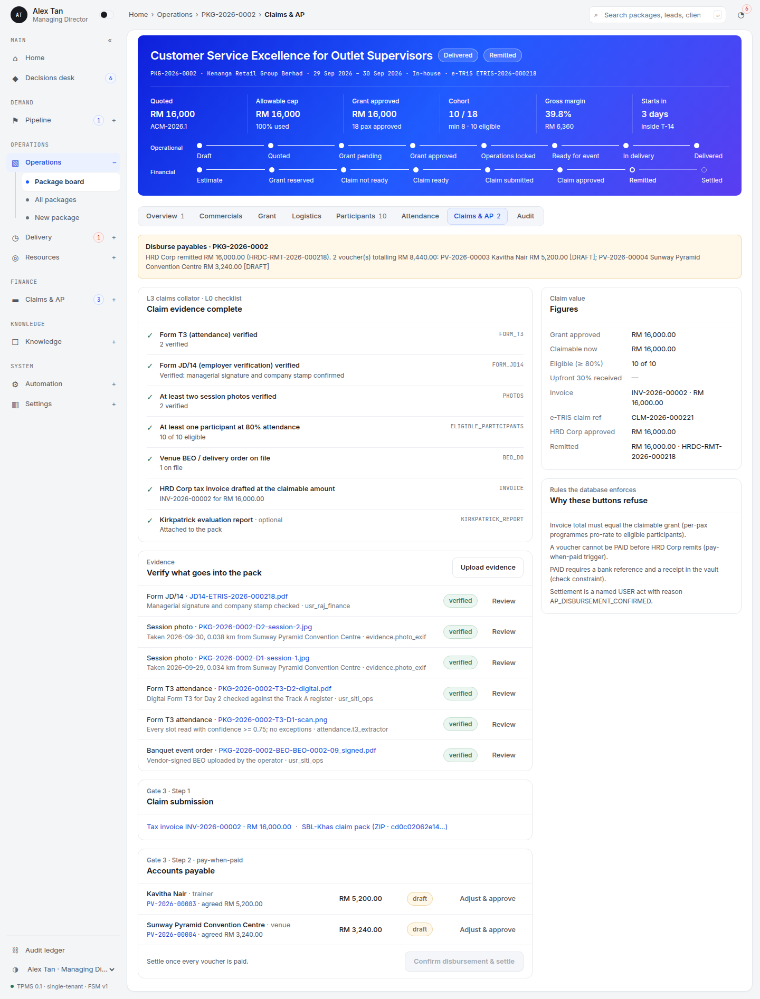 **Gate 3 (claim)**: evidence checklist, claim pack and the claim FSM |
| 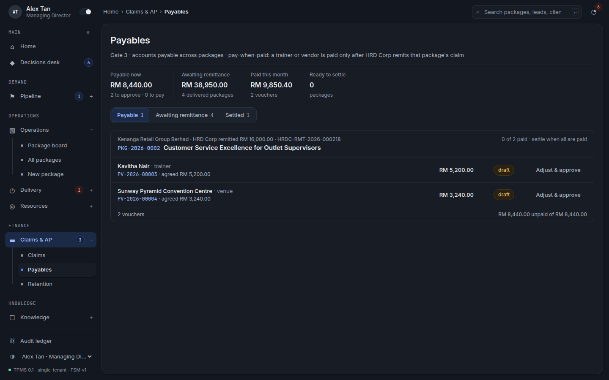 **Gate 3 (AP)**: pay-when-paid vouchers across packages | 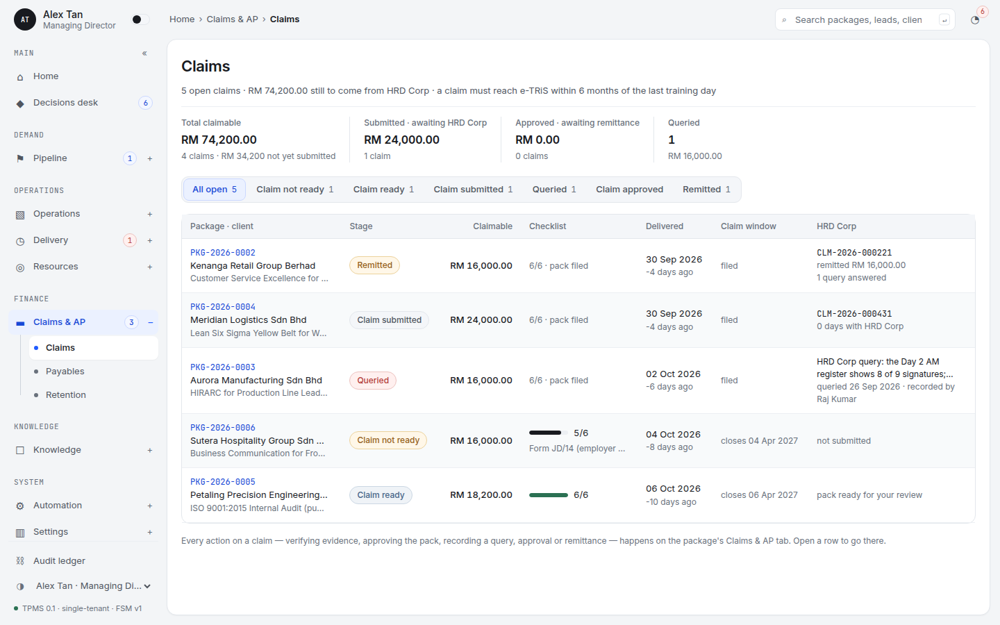 **Claims queue**: every open claim with its 6-month window |
| 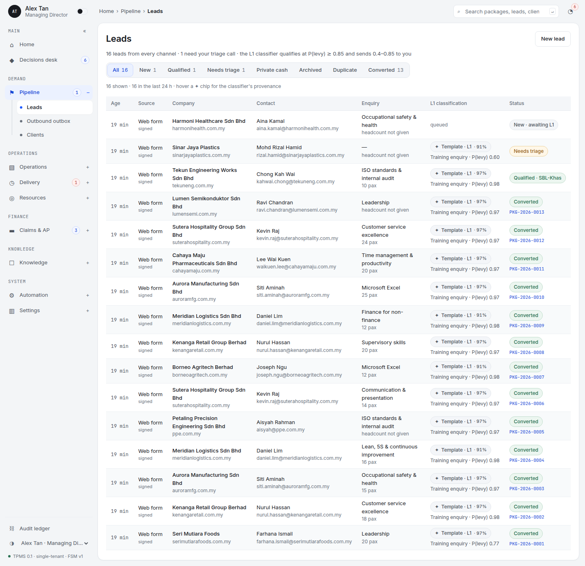 **Leads**: every channel, L1 verdicts with their provenance | 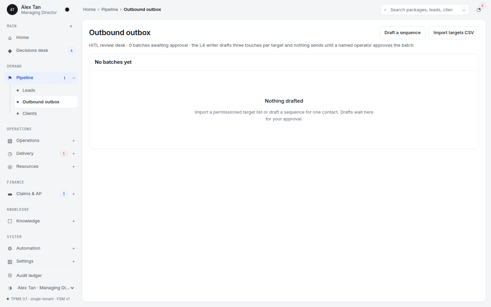 **Outbound outbox**: nothing sends until a named operator approves the batch |
| 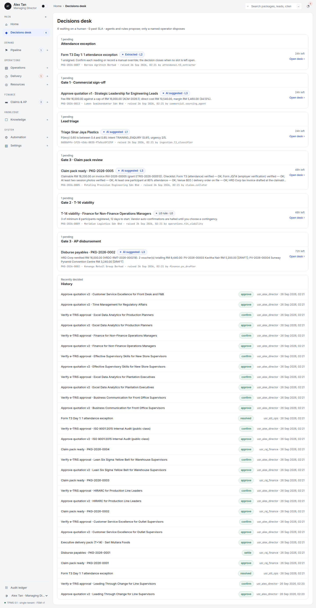 **Decisions desk**: every pending human gate in one queue | 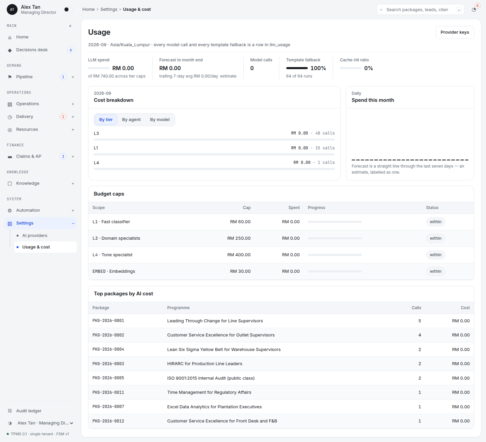 **BYOK usage & cost**: spend by tier, agent, model and package |
| 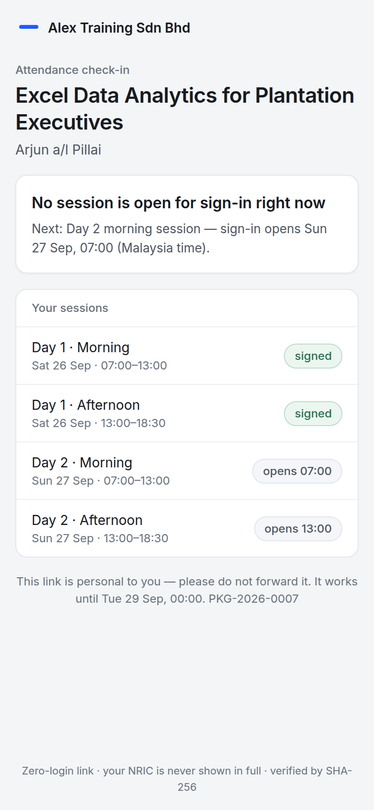 **Participant check-in** (phone, zero-login magic link) | 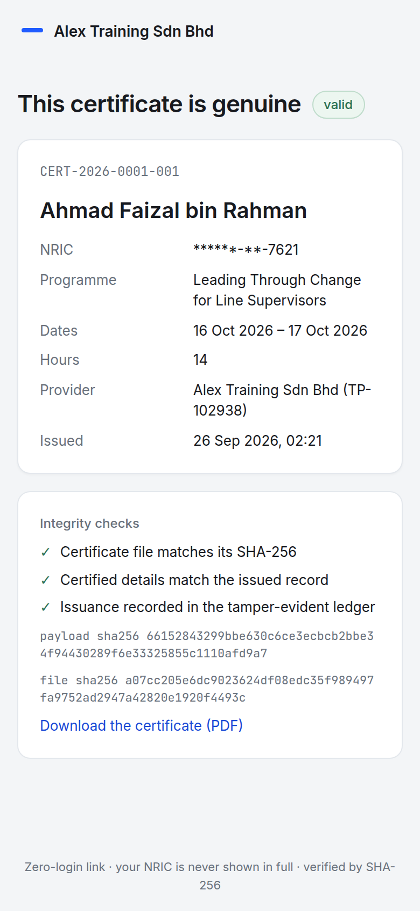 **Public certificate verification** (masked NRIC, SHA-256 checks) |

## Architecture

```
┌──────────────────────── Command cockpit (Next.js 14 App Router) ────────────────────────┐
│ TrainOS shell · Package board (Trainer × Venue × e-TRiS lights) · Decisions desk        │
│ Univer canvas (Gate 1 worksheet, attendance grid) · BYOK keys & cost breakdown · SSE    │
└───────────────────────────────▲─────────────────────────────────────────────────────────┘
                                │ Server Actions · REST (/api/v1) · SSE (/api/v1/events)
┌───────────────────────────────▼─────────────────────────────────────────────────────────┐
│ Application runtime                                                                     │
│  • Operational FSM ⟷ Financial FSM — one transition table, enforced in TS AND Postgres  │
│  • L0 guards (src/server/fsm/guards.ts) evaluated before every move                     │
│  • Task leaser: SELECT … FOR UPDATE SKIP LOCKED (tpms.claim_due), 5-minute leases       │
│  • Headless Univer formula engine for the Allowable Cost Matrix                         │
│  • Append-only audit ledger, SHA-256 hash chain, triggers refuse UPDATE/DELETE/TRUNCATE │
└──────────────▲─────────────────────────────────────────────▲────────────────────────────┘
               │ domain_events (NOTIFY) + task_queue          │ drafts, quotations, decisions
┌──────────────┴──────────────┐                ┌──────────────┴──────────────────────────┐
│ Ingestion & event bus       │                │ 5-tier agent pool                       │
│ Meta · Google · LinkedIn ·  │───────────────▶│ L0 rules · L1 classifier · L2 extraction │
│ WhatsApp · e-mail · web     │                │ L3 DeepSeek-class · L4 Claude-class     │
└─────────────────────────────┘                └──────────────┬──────────────────────────┘
                                                               ▼
┌─────────────────────────────────────────────────────────────────────────────────────────┐
│ PostgreSQL 16 (schema `tpms`) · pgvector (catalogue, NOSS) · pgcrypto (NRIC) · vault    │
└─────────────────────────────────────────────────────────────────────────────────────────┘
```

**Stack:** Next.js 14 (App Router, React 18) · Tailwind 3 on the TrainOS token file · Drizzle ORM
over node-postgres · PostgreSQL 16 + pgvector + pgcrypto · Univer 1.0 (headless formula engine
and browser canvas) · pdf-lib · jose (HS256 magic links) · Vitest against real Postgres ·
Python FastAPI + OpenCV (+ optional PaddleOCR PP-StructureV3) for L2 extraction.

## Running it

Requirements: Node 20+, PostgreSQL 16 with the `vector` and `pgcrypto` extensions, Python 3.11
for the extraction service. A non-superuser role cannot create extensions: run
`create extension vector; create extension pgcrypto;` once as a superuser (on Supabase, enable
them under Database › Extensions).

```bash
cd agentic-tpms
cp .env.example .env            # set DATABASE_URL and the three secrets
npm install
npm run db:migrate              # applies db/migrations/*.sql (checksummed)
npm run db:seed                 # demo portfolio: 13 packages across every stage, 3 open leads
npm run dev                     # cockpit on http://localhost:3100
npm run worker                  # task worker (T-14 checks, OCR, claims, retention …)
```

`npm run db:seed -- --reset` drops and re-migrates first. Stop the worker while seeding, because
the seed runs each package's due tasks itself.

The extraction service (Track B attendance, grant letters):

```bash
cd services/paddleocr
python3 -m venv .venv && . .venv/bin/activate
pip install -r requirements.txt            # OpenCV grid engine (always on)
pip install -r requirements-paddle.txt     # optional: PaddleOCR PP-StructureV3
uvicorn app.main:app --port 8866          # or: npm run ocr:dev (dev mode on)
```

With `TPMS_OCR_DEV=1` the service also synthesises a filled-in scan of a printed Form T3.
The attendance tab offers **Simulate a filled scan**, so the whole OCR path can be demoed
without paper. Without the service, Track B degrades cleanly: digital T3 from Track A
signatures, and grant letters fall back to manual entry.

Or everything at once: `docker compose up` (Postgres + pgvector, cockpit, worker, OCR service).

## Bring your own key

With **no keys at all** the system is fully functional: every agent runs a deterministic
template and says so in its provenance chip (`✦ Template · L3`). Add keys and the same agents
switch to models on their next call — no code change.

| Tier | Default route | Environment variable |
|---|---|---|
| L1 fast classifier | Gemini 2.5 Flash Lite → OpenRouter | `GEMINI_API_KEY` |
| L3 domain specialists | DeepSeek (`deepseek-chat`) → OpenRouter | `DEEPSEEK_API_KEY` |
| L4 tone specialist | Claude Sonnet 5 → OpenRouter | `ANTHROPIC_API_KEY` |
| Embeddings | any OpenAI-compatible `/embeddings` (1536-d) | `OPENAI_COMPATIBLE_API_KEY` + `_BASE_URL` |
| Any tier | OpenRouter | `OPENROUTER_API_KEY` |

Keys can also be added in **Settings › AI providers**: encrypted with AES-256-GCM under
`TPMS_MASTER_KEY`, shown only masked, scoped to tiers, with optional monthly caps.
**Settings › Usage & cost** shows month-to-date spend by tier, agent, model and package, a
labelled linear forecast, cache-hit ratio, template-fallback share and per-tier budget state.
A tier at its cap pauses to its template rather than overspending.

## Moving to Supabase

Supabase is Postgres, so this is a connection-string change:

1. Enable `vector` and `pgcrypto` (Database › Extensions). They live in the `extensions`
   schema; every function here pins `search_path = tpms, extensions, public, pg_temp`.
2. Run the migrations against the Supabase database (`DATABASE_URL=… npm run db:migrate`), or
   copy `db/migrations/*.sql` into `supabase/migrations/`.
3. Everything lives in the **`tpms` schema**, which Supabase's Data API does not expose; the
   migrations also revoke `anon`/`authenticated` from it. Do not add `tpms` to the exposed
   schemas.
4. Use the **session** connection (port 5432) for the worker and for `/api/v1/events` (they
   need `LISTEN` and advisory/row locks across statements). The cockpit's queries are all
   `tpms.`-qualified and transaction-local, so the transaction pooler works for page loads.
5. The vault stores files on the local filesystem behind one module
   (`src/server/storage/vault.ts`); swap `writeBlob`/`readBlob` for Supabase Storage.

## The state machines

See [`docs/STATE_MACHINES.md`](docs/STATE_MACHINES.md) — generated from the transition table
(`npm run docs:fsm`), with Mermaid diagrams and every reason code.

- **Operational:** `DRAFT → QUOTED → GRANT_PENDING → GRANT_APPROVED → OPERATIONS_LOCKED →
  READY_FOR_EVENT → DELIVERY_IN_PROGRESS → DELIVERY_COMPLETED`, exits `POSTPONED`, `CANCELLED`.
- **Financial:** `ESTIMATE → GRANT_RESERVED → [UPFRONT_CLAIM_SUBMITTED] → CLAIM_NOT_READY →
  CLAIM_READY → CLAIM_SUBMITTED ⇄ QUERIED → APPROVED → REMITTED → SETTLED_CLOSED`, exit `VOIDED`.

The same table exists twice — `src/server/fsm/transitions.ts` and `tpms.fsm_transitions` — and a
test asserts they are identical. The database refuses any `training_packages` UPDATE that does
not carry `tpms.actor_type` + `tpms.reason_code`, and any stage change that is not in the table
for that actor and reason. **No transition accepts an `AGENT` actor.**

## The three HITL gates

- **Gate 1 — Commercial outbox & quotation desk** (`/operations/<code>/commercials`): DRAFT →
  QUOTED requires `actor_type = USER` and `reason_code = COMMERCIAL_TERMS_APPROVED`; the audit
  row carries a field-level diff of line items between the agent's draft and the approved sheet.
- **Gate 2 — T-14 viability & contingency desk** (`/operations/<code>/logistics`): a leased
  task at start − 14 days; below the minimum cohort, vendor auto-confirmations halt and a
  decision offers postpone / pivot to ROT / cancel / proceed, each with its exposure.
- **Gate 3 — Claims audit & AP disbursement desk** (`/operations/<code>/claims`): claim pack
  approval, then every payment voucher needs a bank reference and a receipt; the database
  refuses PAID before HRD Corp has remitted (pay-when-paid) and REMITTED → SETTLED_CLOSED
  needs `AP_DISBURSEMENT_CONFIRMED` from a named user.

All pending gates appear on the **Decisions desk** (`/decisions`).

**Where things are**

| Area | Screens |
|---|---|
| Demand | `/leads` inbox and lead detail (L1 verdict, triage, micro-TNA, convert) · `/outbox` outbound batches (approve before anything sends) · `/clients` |
| Operations | `/operations` board (Trainer × Venue × e-TRiS lights) · `/operations/new` · a package record with its Overview, Commercials, Grant, Logistics, Participants, Attendance, Claims & AP and Audit tabs |
| Delivery | `/delivery/attendance` cross-package desk · `/delivery/certificates` · on the package: the Univer exception grid, T3 scans, EXIF photos, magic links and a projected room QR |
| Participants (public, no login) | `/c/<token>` check-in with a signature · `/c/s/<token>` room QR · `/q/<token>` pre/post quiz · `/verify/<serial>` certificate check |
| Finance | `/finance/claims` queue with the 6-month window · `/finance/payables` pay-when-paid AP · `/finance/retention` T+14/T+90/T+300 drafts · KPIs on Home |
| Knowledge | `/knowledge/catalog` semantic search · `/knowledge/cost-matrix` versioned Allowable Cost Matrix |
| System | `/system/agents` · `/system/queue` · `/system/audit` · `/settings/ai/keys` (BYOK) · `/settings/ai/usage` (cost breakdown) |

## Compliance

- **Audit ledger** (`tpms.audit_ledger`): each row's checkpoint is
  `SHA-256(previous checkpoint ‖ canonical row)`; the chain head is a single row taken
  `FOR UPDATE`, so concurrent writers serialise instead of forking the chain. Triggers refuse
  UPDATE, DELETE and TRUNCATE; `tpms.audit_verify_chain()` recomputes from genesis and finds a
  row altered by anyone who bypassed the triggers (`npm run audit:verify`).
- **Evidence vault** (`tpms.compliance_vault`): content-addressed files, immutable rows (only
  verification fields may change), every insert and verdict audited, bytes re-hashed on every
  download — a tampered file is refused with 409, never served.
- **PII (PDPA)**: NRIC/passport numbers are validated (MyKad date check), stored as an HMAC
  under a server pepper (a plain SHA-256 of a 12-digit NRIC is brute-forceable), encrypted with
  pgcrypto AES-256, and shown only as `******-**-1234`, including on certificates.
- **Cost policy**: the Allowable Cost Matrix is versioned policy data, not code
  (`tpms.cost_matrix_policies`, editable in Knowledge › Cost matrix).

## The golden path

`npm run golden-path` drives **one package from an inbound web-form lead to `SETTLED_CLOSED`**.
It uses only the domain services and the worker's own task handlers, with no inserts into
domain tables. It prints a step table, then checks the audit chain, the task queue and the
certificates. An abridged real run:

```
 #  step               operational                        financial
 2  lead.ingest        lead → LEAD_INGESTED                —            WEB_FORM, lead.triage queued in-transaction
 3  lead.triage        lead → TRIAGE_REVIEW                —            L1 template: P(levy) 0.769 → review band
 4  lead.qualify       lead → LEAD_QUALIFIED_TNA           —            operator; WhatsApp micro-TNA reply parsed
 5  lead.convert       — → DRAFT                           — → ESTIMATE
 6  proposal.draft     DRAFT                               ESTIMATE     pgvector course match, trainer + venue, Univer price
 7  gate1.approve      DRAFT → QUOTED                      ESTIMATE     operator edits a cell; line-item diff in the audit row
 8  client.accept      QUOTED → GRANT_PENDING              → GRANT_RESERVED   e-TRiS dossier compiled
 9  grant.letter       GRANT_PENDING                       GRANT_RESERVED     L2 extraction: grant ID, amount, pax
10  grant.confirm      → GRANT_APPROVED                    GRANT_RESERVED     viability.t14_check scheduled
11  logistics.lock     → OPERATIONS_LOCKED                 GRANT_RESERVED     trainer confirmed, BEO signed
13  t14                → READY_FOR_EVENT                   GRANT_RESERVED     ⏩ fast-forward: T-14 check run now
14  links              READY_FOR_EVENT                     GRANT_RESERVED     12 magic links; PRE quiz mean 45%
15  delivery.start     → DELIVERY_IN_PROGRESS              GRANT_RESERVED     ⚠ STARTED_EARLY (operator, ahead of day 1)
16  attendance.day1    …                                                    Track A e-signatures + one room-QR check-in
17  t3.day1            …                                                    paper T3 → OCR: 23/24 present, 1 UNSIGNED exception
18  t3.resolve         …                                                    operator resolves it ABSENT with a note
21  photos             …                                                    EXIF GPS 0.03 km from venue → VERIFIED ×2
23  delivery.complete  → DELIVERY_COMPLETED                → CLAIM_NOT_READY   ⚠ SOME_BELOW_80; 11 certificates VALID
24  claim.evidence     DELIVERY_COMPLETED                  → CLAIM_READY      JD/14 verified; tax invoice + claim pack
25–28 claim …          DELIVERY_COMPLETED                  → SUBMITTED → QUERIED → SUBMITTED → APPROVED
29  claim.remit        DELIVERY_COMPLETED                  → REMITTED         pay-when-paid opens; PVs drafted
30  ap.settle          DELIVERY_COMPLETED                  → SETTLED_CLOSED   PVs paid (bank ref + receipt)
31  retention.t14      DELIVERY_COMPLETED                  SETTLED_CLOSED     ⏩ T+14 executive pack drafted, approved, sent
Audit chain: INTACT · dead-lettered tasks: 0
```

**What "fast-forward" means.** Some tasks are due in the future. The T-14 check, the T+14
retention run and the day-1 `delivery.start` are run immediately through their real
handlers, and each is logged with ⏩. Participant actions (check-ins, quizzes) pass an
explicit `now` inside each session window. Delivery is started early by an operator, which
the L0 guard allows with a recorded `STARTED_EARLY` warning. Nothing is backdated: training
dates are real future dates.

## Testing

```bash
npm run typecheck
npm test                      # unit + integration, against TEST_DATABASE_URL (rebuilt per file)
npm run test:ocr              # the extraction service's own pytest suite
npm run golden-path           # full lifecycle end to end against DATABASE_URL
npm run audit:verify          # recompute the audit hash chain from genesis
```

Integration tests run against real Postgres, because the guards under test live in triggers.
At the time of writing: **522 Vitest tests in 51 files** (including the golden path and the
seed) and **28 pytest tests**, all passing. `next build` is green for all 47 routes.
`npm test` reads `.env` itself; variables already set in the environment win.

## Repository map

```
agentic-tpms/
  db/migrations/ + db/rollbacks/   SQL is the source of truth (checksummed runner)
  src/app/(cockpit)/               operator screens      src/app/(public)/   /c /q /verify
  src/app/api/v1/                  webhooks, vault, SSE, public certificate downloads
  src/components/kit/              the TrainOS kit, forked (one design system)
  src/server/fsm/                  transition table, L0 guards, transition service
  src/server/queue/                claimDue leasing, worker, handler registry
  src/server/ai/                   BYOK providers, tier router, budgets, embeddings, usage
  src/server/{ingestion,outbound,messaging}/   Stage 1
  src/server/{pricing,knowledge,commercial,grant}/   Stages 2–3
  src/server/{operations,participants,resources}/    Stage 4
  src/server/{attendance,extraction,assessments,certificates}/   Stage 5
  src/server/{claims,finance,retention}/     Stages 6–7
  src/server/demo/                 golden path + demo portfolio (real services only)
  scripts/                         migrate, seed, golden-path, audit-verify, screenshots, docs:fsm
  services/paddleocr/              L2 extraction microservice (FastAPI)
  worker/                          task worker entry point
  tests/                           unit + integration (real Postgres)
```

## Honest limitations

- **Statutory numbers are configuration.** The seeded Allowable Cost Matrix bands come from the
  project's handoff specification (in-house RM 6,000–14,000/day, public RM 1,300/pax/day); ROT
  values are illustrative. Verify against the current HRD Corp circular before production.
- **Illustrative knowledge.** Seeded JPK/NOSS codes and focus-area texts are illustrative, not
  an official registry extract. All demo companies, people and venues are fictional.
- **Submission to HRD Corp is manual.** The system prepares the e-TRiS dossier and the claim
  pack and records the submission reference; it does not drive the e-TRiS portal.
- **Bank transfers are logged, not executed** (host-to-host banking is out of scope by the
  PRD); the operator records the bank reference and uploads the receipt.
- **No scraping.** Outbound signal enrichment accepts permissioned lists and webhooks only.
- **Identity.** Operators authenticate with HTTP Basic (`TPMS_BASIC_AUTH`) and pick "acting as";
  SSO is deferred.
- **OCR accuracy on real paper is unmeasured.** The Form T3 reader (OpenCV template grid, with
  fiducials and a QR on every page) is calibrated on synthesised scans. PaddleOCR PP-StructureV3
  is optional; its model hosts were unreachable from the build sandbox, so the printed-name
  cross-check has not run end to end. The design sends anything ambiguous to the exception desk
  rather than guessing. Every unsigned cell is an exception an operator confirms.
- **Room-QR identity is light by design.** It uses a name plus the last 4 NRIC digits, with an
  in-memory, per-process limit on failed attempts. Put a shared rate limiter in front before
  running several instances.
- **The demo scan is synthesised.** The golden path's Track B sheet is rendered by the service's
  dev synthesiser from the real template, not photographed.
- **Cost-matrix corrections.** Revising bands publishes a new version. The in-place correction
  refuses a version any quotation cites, but it checks without a lock, so a quotation priced in
  the same instant could slip past it.
