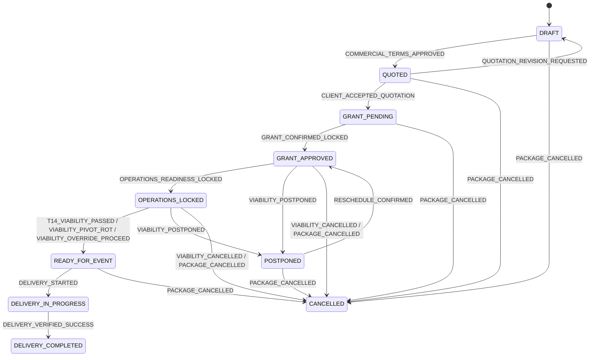
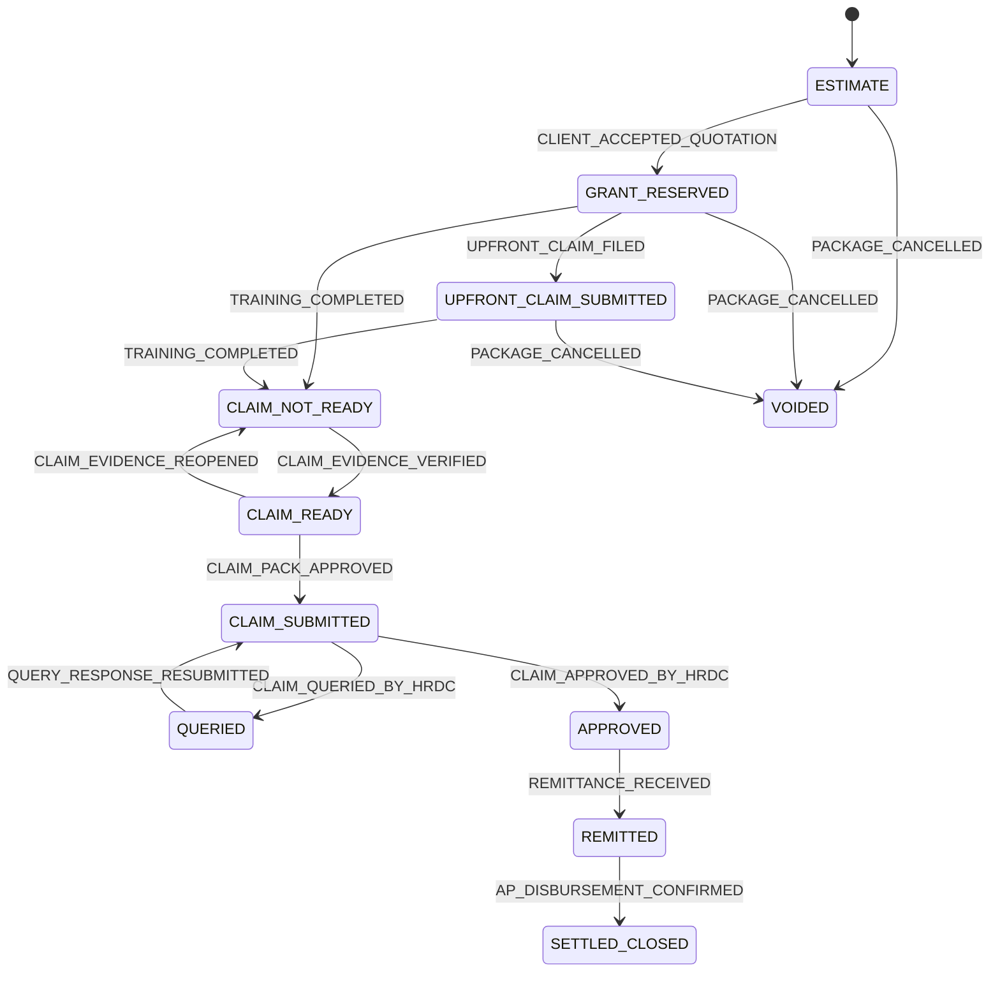

# State machines

> Generated by `npm run docs:fsm` from `src/server/fsm/transitions.ts`. Do not edit by hand.
> The same table is seeded into `tpms.fsm_transitions` and enforced by the `packages_before_update`
> trigger on every UPDATE; `tests/integration/fsm-parity.test.ts` asserts the two copies are equal.

No transition accepts an `AGENT` actor: agents propose (drafts, quotations, decisions); a named
`USER` or the `SYSTEM` rule engine moves a package. Every move writes a SHA-256 hash-chained row to
`tpms.audit_ledger` with the actor, the reason code and a field-level diff.

## Operational lifecycle

Stages: `DRAFT` (Draft), `QUOTED` (Quoted), `GRANT_PENDING` (Grant pending), `GRANT_APPROVED` (Grant approved), `OPERATIONS_LOCKED` (Operations locked), `READY_FOR_EVENT` (Ready for event), `DELIVERY_IN_PROGRESS` (In delivery), `DELIVERY_COMPLETED` (Delivered), `POSTPONED` (Postponed), `CANCELLED` (Cancelled).

| From | To | Reason code | Allowed actors | L0 guard | Meaning |
|---|---|---|---|---|---|
| `DRAFT` | `QUOTED` | `COMMERCIAL_TERMS_APPROVED` | USER | yes | Gate 1: operator approves the priced quotation and dispatches it |
| `QUOTED` | `DRAFT` | `QUOTATION_REVISION_REQUESTED` | USER | yes | Client asked for a revised quotation |
| `QUOTED` | `GRANT_PENDING` | `CLIENT_ACCEPTED_QUOTATION` | USER | yes | Client accepted; HR files the e-TRiS grant application |
| `GRANT_PENDING` | `GRANT_APPROVED` | `GRANT_CONFIRMED_LOCKED` | USER | yes | Operator verified the extracted e-TRiS approval letter |
| `GRANT_APPROVED` | `OPERATIONS_LOCKED` | `OPERATIONS_READINESS_LOCKED` | USER, SYSTEM | yes | Trainer confirmed with TTT, venue BEO signed (or not required) |
| `GRANT_APPROVED` | `POSTPONED` | `VIABILITY_POSTPONED` | USER | yes | Gate 2: postpone inside the free venue window |
| `GRANT_APPROVED` | `CANCELLED` | `VIABILITY_CANCELLED` | USER | yes | Gate 2: cancel and release tentative holds |
| `OPERATIONS_LOCKED` | `READY_FOR_EVENT` | `T14_VIABILITY_PASSED` | SYSTEM, USER | yes | T-14 cohort check passed |
| `OPERATIONS_LOCKED` | `READY_FOR_EVENT` | `VIABILITY_PIVOT_ROT` | USER | yes | Gate 2: pivot to Remote Online Training, venue released |
| `OPERATIONS_LOCKED` | `READY_FOR_EVENT` | `VIABILITY_OVERRIDE_PROCEED` | USER | yes | Gate 2: operator proceeds below minimum cohort |
| `OPERATIONS_LOCKED` | `POSTPONED` | `VIABILITY_POSTPONED` | USER | yes | Gate 2: postpone inside the free venue window |
| `OPERATIONS_LOCKED` | `CANCELLED` | `VIABILITY_CANCELLED` | USER | yes | Gate 2: cancel and release tentative holds |
| `POSTPONED` | `GRANT_APPROVED` | `RESCHEDULE_CONFIRMED` | USER | yes | New dates confirmed; vendors must re-lock |
| `READY_FOR_EVENT` | `DELIVERY_IN_PROGRESS` | `DELIVERY_STARTED` | SYSTEM, USER | yes | Day 1 of delivery |
| `DELIVERY_IN_PROGRESS` | `DELIVERY_COMPLETED` | `DELIVERY_VERIFIED_SUCCESS` | SYSTEM, USER | yes | Attendance verified, evidence captured |
| `DRAFT` | `CANCELLED` | `PACKAGE_CANCELLED` | USER | yes | Cancelled before quotation |
| `QUOTED` | `CANCELLED` | `PACKAGE_CANCELLED` | USER | yes | Client declined |
| `GRANT_PENDING` | `CANCELLED` | `PACKAGE_CANCELLED` | USER | yes | Grant refused or withdrawn |
| `GRANT_APPROVED` | `CANCELLED` | `PACKAGE_CANCELLED` | USER | yes | Cancelled after grant approval |
| `OPERATIONS_LOCKED` | `CANCELLED` | `PACKAGE_CANCELLED` | USER | yes | Cancelled after lock |
| `READY_FOR_EVENT` | `CANCELLED` | `PACKAGE_CANCELLED` | USER | yes | Cancelled before delivery |
| `POSTPONED` | `CANCELLED` | `PACKAGE_CANCELLED` | USER | yes | Postponed package cancelled |

## Financial & claim lifecycle

Stages: `ESTIMATE` (Estimate), `GRANT_RESERVED` (Grant reserved), `UPFRONT_CLAIM_SUBMITTED` (Upfront 30% filed), `CLAIM_NOT_READY` (Claim not ready), `CLAIM_READY` (Claim ready), `CLAIM_SUBMITTED` (Claim submitted), `QUERIED` (Queried), `APPROVED` (Claim approved), `REMITTED` (Remitted), `SETTLED_CLOSED` (Settled), `VOIDED` (Voided).

| From | To | Reason code | Allowed actors | L0 guard | Meaning |
|---|---|---|---|---|---|
| `ESTIMATE` | `GRANT_RESERVED` | `CLIENT_ACCEPTED_QUOTATION` | USER, SYSTEM | yes | Quotation accepted; grant value reserved |
| `GRANT_RESERVED` | `UPFRONT_CLAIM_SUBMITTED` | `UPFRONT_CLAIM_FILED` | USER | yes | Optional 30% upfront grant claim filed |
| `GRANT_RESERVED` | `CLAIM_NOT_READY` | `TRAINING_COMPLETED` | SYSTEM, USER | yes | Delivery completed; evidence collation begins |
| `UPFRONT_CLAIM_SUBMITTED` | `CLAIM_NOT_READY` | `TRAINING_COMPLETED` | SYSTEM, USER | yes | Delivery completed; balance claim collation begins |
| `CLAIM_NOT_READY` | `CLAIM_READY` | `CLAIM_EVIDENCE_VERIFIED` | SYSTEM, USER | yes | T3, JD/14, photos verified and invoice drafted |
| `CLAIM_READY` | `CLAIM_NOT_READY` | `CLAIM_EVIDENCE_REOPENED` | SYSTEM, USER | yes | A claim document was flagged after verification |
| `CLAIM_READY` | `CLAIM_SUBMITTED` | `CLAIM_PACK_APPROVED` | USER | yes | Gate 3: operator approved the claim pack for e-TRiS submission |
| `CLAIM_SUBMITTED` | `QUERIED` | `CLAIM_QUERIED_BY_HRDC` | USER | yes | HRD Corp raised a query |
| `QUERIED` | `CLAIM_SUBMITTED` | `QUERY_RESPONSE_RESUBMITTED` | USER | yes | Query answered and resubmitted |
| `CLAIM_SUBMITTED` | `APPROVED` | `CLAIM_APPROVED_BY_HRDC` | USER | yes | HRD Corp approved the claim |
| `APPROVED` | `REMITTED` | `REMITTANCE_RECEIVED` | USER | yes | Remittance advice received and banked |
| `REMITTED` | `SETTLED_CLOSED` | `AP_DISBURSEMENT_CONFIRMED` | USER | yes | Gate 3: every payment voucher paid with bank reference and receipt |
| `ESTIMATE` | `VOIDED` | `PACKAGE_CANCELLED` | USER, SYSTEM | yes | Package cancelled before acceptance |
| `GRANT_RESERVED` | `VOIDED` | `PACKAGE_CANCELLED` | USER, SYSTEM | yes | Package cancelled; reservation released |
| `UPFRONT_CLAIM_SUBMITTED` | `VOIDED` | `PACKAGE_CANCELLED` | USER, SYSTEM | yes | Package cancelled; upfront claim must be refunded |

## Coupling between the machines

| When the operational machine enters | The financial machine | Reactions enqueued (same transaction) |
|---|---|---|
| `QUOTED` | — | `commercial.dispatch_quotation` |
| `GRANT_PENDING` (client accepted) | `ESTIMATE → GRANT_RESERVED` | `grant.compile_dossier` |
| `GRANT_APPROVED` | — | `viability.t14_check` due at start − 14 days (MYT) |
| `READY_FOR_EVENT` | — | `delivery.issue_magic_links`, `delivery.start` at 07:00 on day 1 |
| `DELIVERY_COMPLETED` | `GRANT_RESERVED / UPFRONT_CLAIM_SUBMITTED → CLAIM_NOT_READY` | `certificates.issue`, `retention.schedule` |
| `CANCELLED` | `→ VOIDED` (if not yet claimed) | — |

| When the financial machine enters | Reactions |
|---|---|
| `CLAIM_NOT_READY` | `claims.collate` (verifies evidence, drafts the invoice, compiles the claim pack) |
| `REMITTED` | `finance.draft_payment_vouchers` (pay-when-paid: PVs cannot be PAID before this stage) |
